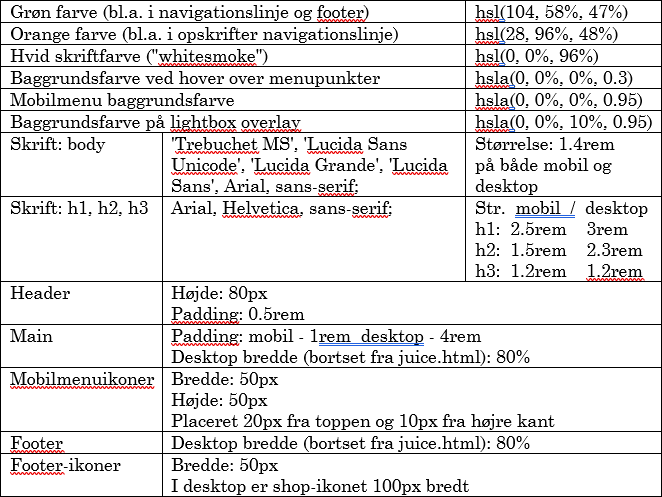

# Fruit and Fastfood

### Specifications

#### Overall requirements

- [ ] Responsive and mobile first
  - [ ] Responsive
  - [ ] Mobile first
- [ ] Works on mobile and desktop
- [ ] Use HTML, CSS and JavaScript
- [ ] Has to use either CSS Grid or CSS Flexbox
- [ ] Has to have CSS transitions and/or animations
- [ ] Can use code from the internet or previous projects, but you have to understand and be able explain everything
- [ ] SEO friendly

#### Design requirements

- [ ] Has to look like the screenshots and video in the assets folder
- [x] Has to use the following specifications:
      
- [ ] Ask **Big Boss** if you are unsure and need clarification about the design

#### Functionality requirements

- [ ] Header
  - [x] The company logo in the header should bring the user back to the main page
  - [ ] Stick to the top of the page, even if you scroll down
- [ ] Footer
  - [ ] Nothing special, just follow the screenshots
- [ ] Menu structure
  - [ ] Responsive menu structure
  - [ ] The menu should be a burger menu on phones, you can use menu icons or make your own
  - [ ] The menu should be a horizontal menu on desktop
- [ ] Slideshow bar
  - [ ] The pages index.html, opskrifter.html and frugt.html should have a slideshow with juice pictures on the sidebar on the right side
  - [ ] Make a transition between the slideshow images
  - [ ] The slideshow should have a constant position on the side of the users screen
  - [ ] The text right bellow the slide should also change with the image. The text should be replaced with the alt-text on the image.
  - [ ] DON'T CHANGE THE ALT TEXT ON THE IMAGES, IT'S FOR SEO PURPOSES!
  - [ ] The slideshow shouldn't be on the mobile display or on **juice.html**
- [ ] Index.html
  - [ ] The homepage (index.html) should have the logo and introduction text. The desktop version should have two columns. And the mobile version should have one column.
  - [ ] The mobile version shouldn't display the logo.
  - [ ] The front page should also have images and a description of the menu items. The desktop version should have three columns. And the mobile version should have one column.
  - [ ] The images and title on the blog posts should also have an animated hover effect.
  - [ ] All images and text on the homepage should lead to a lightbox that opens as an overlay with additional information about the ingredients in the menu.
  - [ ] The mobile version shouldn't have a hover effect or lightbox. The extra information about the menu should therefore be displayed on the front page immediately.
- [ ] frugt.html
  - [ ] Include a small description and introduction with images of the fruits being featured this week.
  - [ ] Mobile version should have the pictures in a single column, and the desktop version should have 3 columns.
  - [ ] Add a lightbox and hover-effect, should work like the lightbox and hover-effect on the main page.
- [ ] opskrifter.html
  - [ ] Should have a submenu with bookmarked recipes.
  - [ ] Make a scroll-effect (idk what the client wants, ask them later.)
  - [ ] Lightbox and hover animation. Only on desktop browsers.
  - [ ] Ingredients and "How to" should be placed light bellow in a single column below each other. The desktop version should have two columns right next to each other. I also have to ask the client about this later.
- [ ] juice.html
  - [ ] On the page with `"Har du prøvet en af vores friskpressede juicer til kun 35kr?"` the slideshow shouldn't be displayed.
  - [ ] The 4 images of juice with accompanying text should be right bellow it in a single column on mobile browsers. The desktop version should have four columns next to each other.

#### SEO

**Index.html:** fastfood, økologisk, sund mad, sund fastfood, takeaway
**Frugt.html:** frugt, økologisk frugt, sund fastfood
**Opskrifter.html:** opskrifter, sund mad, økologisk, sund fastfood
**Juicer.html:** juice, økologisk juice, sund fastfood, takeaway

### Assessment criteria and evaluation

- Fuldstændighed - hvor meget er lavet færdigt?
- Struktur - anvendelse af relevante HTML, CSS og JavaScript teknikker og værktøjer
- Hvor godt har du fulgt kravspecifikationen
- I hvor høj grad du har overblik over din kode
- Kommentarer, navngivning, overskuelighed og struktur af kode i HTML, CSS og JavaScript med mere
- Søgemaskineoptimering
- Hvordan du præsenterer din løsning
